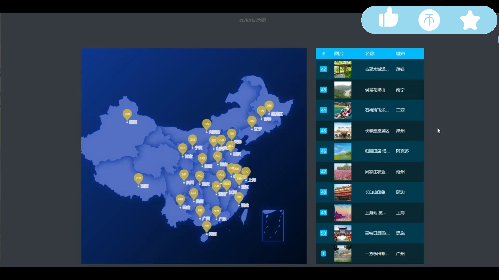

## 计算机毕业设计SparkStreaming+Kafka旅游推荐系统 旅游景点客流量预测 旅游可视化 旅游大数据 Hive数据仓库 机器学习 深度学习

## 要求
### 源码有偿！一套(论文 PPT 源码+sql脚本+教程)

### 
### 加好友前帮忙start一下，并备注github有偿新旅游推荐
### 我的QQ号是2827724252或者798059319或者 1679232425或者微信:bysj2023nb

# 

### 加qq好友说明（被部分 网友整得心力交瘁）：
    1.加好友务必按照格式备注
    2.避免浪费各自的时间！
    3.当“客服”不容易，repo 主是体面人，不爆粗，性格好，文明人。
## 系统介绍：
```
全部属于个人独创原创设计，支持所有系统的二次开发or改皮肤or换题材；
实时推荐：使用Flume流式计算采集用户行为数据，采用kafka+zookeeper+Spark_streaming流式实时训练模型推荐+hadoop分布式存储+vue+springboot展示推荐结果；
实时推荐+离线推荐双模型实现【景点】推荐；
利用VMware创建装杯Linux虚拟机实现分布式架构；
网站端：结合百度地图技术的景点标注（+实时出行建议）、路线规划；LSTM评论情感分析、景点地点热度词云分析、高级搜索、浏览历史
景点地区分析、热度分析、词云分析、基于机器学习的人流量预测
高级大屏、如柱状图、饼图、花瓣图、词云、评论词云、折线图、漏斗图分析等；
管理端实现增删改查、评论管理、景点管理、用户管理；
```


## 系统功能架构
```
采用了vue.js+springboot+Spark_streaming+hadoop+hdfs+kafka+flume的核心架构
5+1+1+1+N架构： 5个前端（APP端+安卓端+网站端+管理系统端+大屏可视化端） + 1个Java后端 + 1个mysql数据库+1个爬虫端+分布式大数据架构
```


## 
## 演示截图





